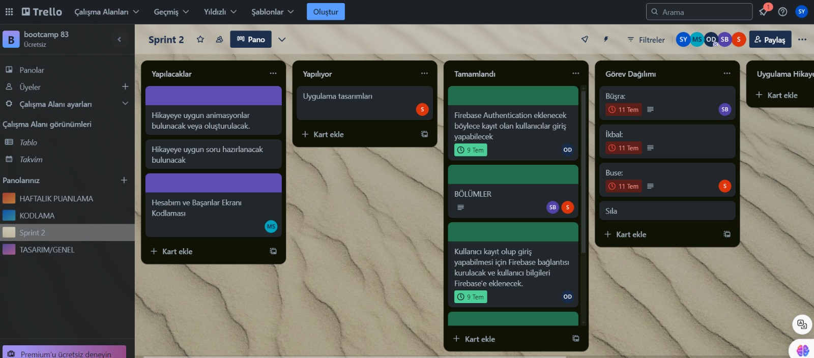
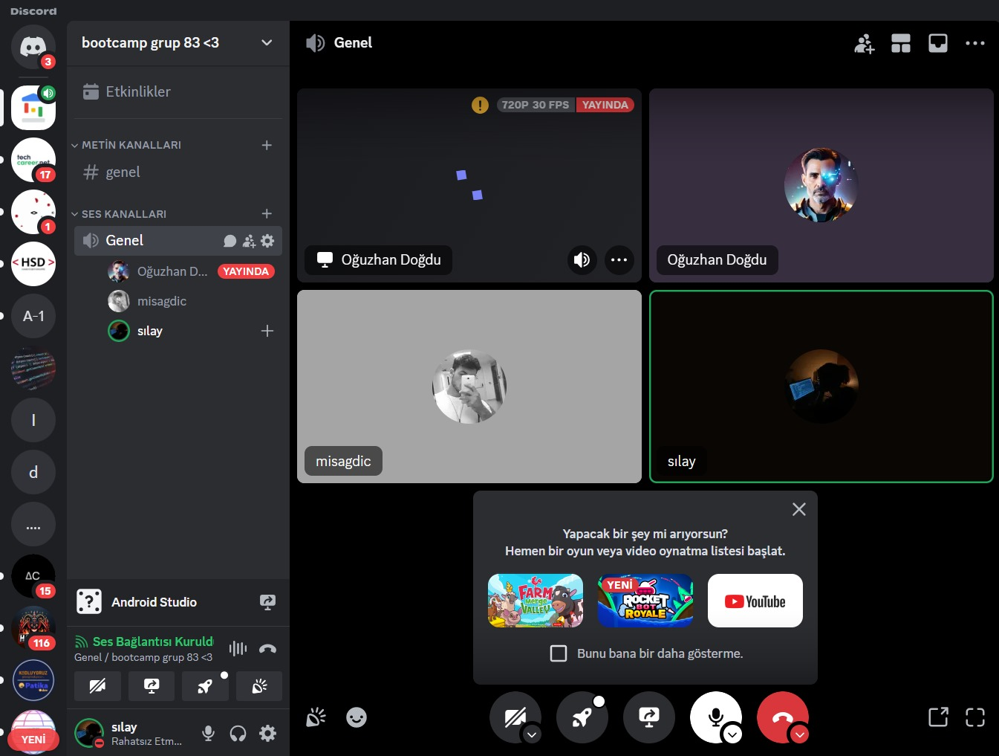
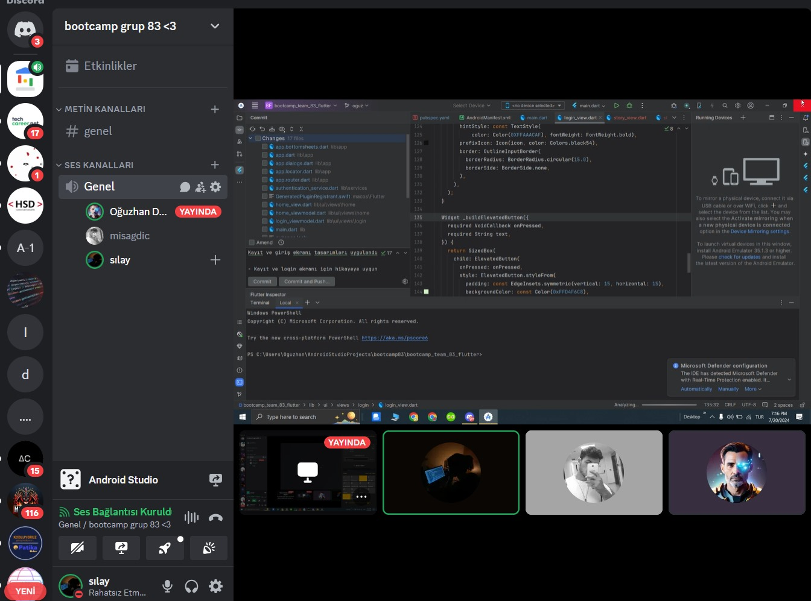
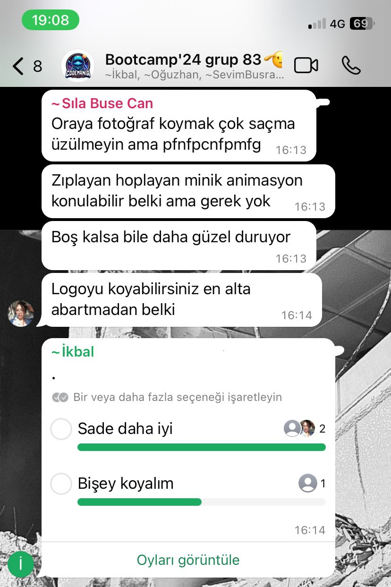
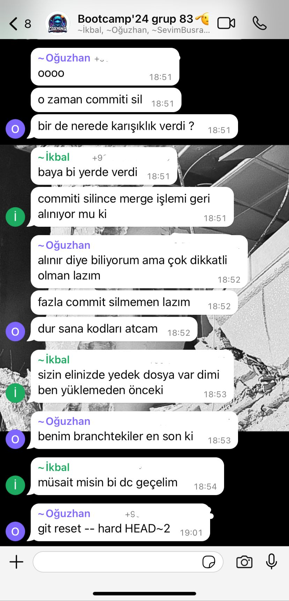
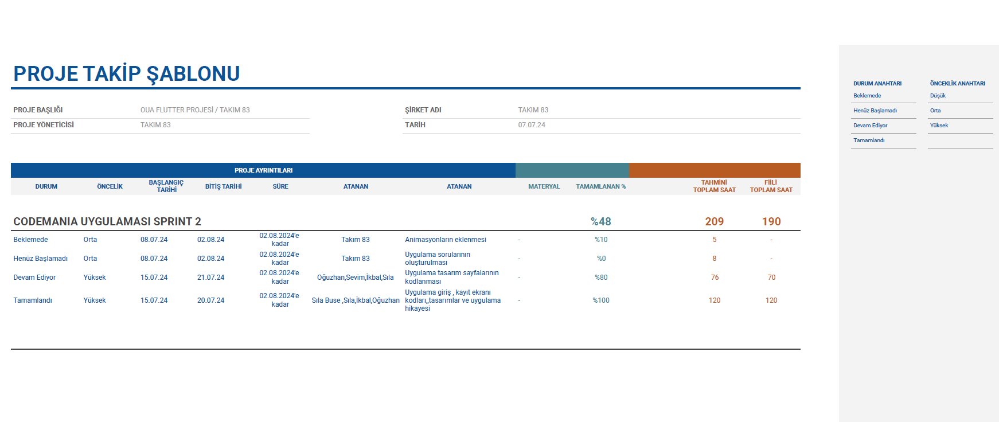
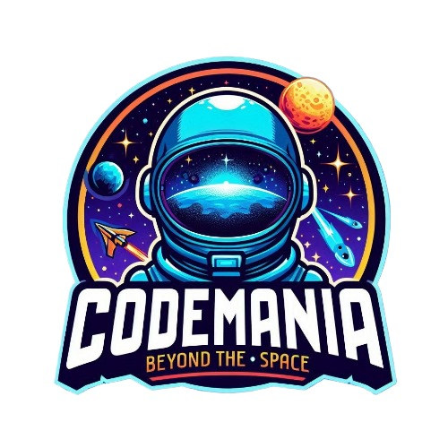

# Bootcamp-Team-83-Flutter
## ÜRÜN BİLGİLERİ 

## TAKIM ÜYELERİ
| İsim        | LinkedIn                                      | GitHub                                     |
|-------------|-----------------------------------------------|--------------------------------------------|
| Sıla YELER    | [Sıla YELER LinkedIn](https://www.linkedin.com/in/s%C4%B1layeler/) | [Sıla YELER GitHub](https://github.com/silayeler) | 
| Sevim Büşra GÜL | [Sevim Büşra GÜL LinkedIn](https://www.linkedin.com/in/sevimbusra/) | [Sevim Büşra GÜL](https://github.com/SevimBusraGul78) |
| Sıla Buse CAN | [Sıla Buse CAN LinkedIn](https://www.linkedin.com/in/s%C4%B1la-buse-can-250b83245/) | [Sıla Buse CAN](https://github.com/SlaBuse) |
| Muhammet İkbal SAĞDIÇ  | [Muhammet İkbal SAĞDIÇ LinkedIn](https://www.linkedin.com/in/muhammet-ikbal-sa%C4%9Fd%C4%B1%C3%A7-38515a178/) | [Muhammet İkbal SAĞDIÇ GitHub](https://github.com/misagdic) |
| Oğuzhan DOĞDU| [Oğuzhan DOĞDU LinkedIn](https://www.linkedin.com/in/oguzhan-dogdu-62415023a/) | [Oğuzhan DOĞDU](https://github.com/oguzdgd) |

1. *Sevim Büşra GÜL* : Developer
2. *Sıla Buse CAN* : Product Owner
3. *Muhammet İkbal SAĞDIÇ* : Developer
4. *Sıla YELER* : Scrum Master
5. *Oğuzhan DOĞDU* : Developer

## ÜRÜN İSMİ
--Kod Canavarı--

## ÜRÜN AÇIKLAMASI
Ürün Açıklaması
Kod Öğreticisi Uygulaması, kullanıcıların kodlama öğrenme süreçlerini eğlenceli ve etkili bir şekilde deneyimlemelerini sağlayan yenilikçi bir eğitim platformudur. Bu uygulama, kullanıcıları çeşitli hikayeler ve görevler aracılığıyla programlama becerilerini geliştirmeye teşvik eder. Kullanıcılar, belirli hedeflere ulaşarak ilerlerken, adım adım programlama kavramlarını öğrenirler ve bu süreçte öğrendiklerini hemen uygulama fırsatı bulurlar.

Uygulama Birincil Fonksiyonu
Kod Öğreticisi Uygulaması, kullanıcıların temel programlama kavramlarından ileri düzey algoritmalara kadar her seviyede kodlama becerilerini geliştirmelerine yardımcı olur. Her bir bölüm, kullanıcıya yeni kodlama becerileri kazandıran bir macera ve engellerle doludur. Kullanıcılar, belirli görevleri tamamlayarak ve engelleri aşarak ilerler.

Uygulama İkincil Fonksiyonu
Kod Öğreticisi Uygulaması, kullanıcıların öğrendiklerini hemen uygulama fırsatı bulmaları için etkileşimli öğrenme deneyimleri sunar. Her bölümde karşılaşılan bulmacalar ve kodlama görevleri, kullanıcıların pratik yapmalarını sağlar. Ayrıca, başarımlar, rozetler ve puanlarla kullanıcılar ödüllendirilir, bu da motivasyonu artırır ve öğrenmeyi eğlenceli hale getirir.

## ÜRÜN ÖZELLİKLERİ
Sürükleyici Hikaye: Kullanıcılar, çeşitli hikayeler ve görevler aracılığıyla kodlama öğrenirler ve her bölümde yeni bir maceraya atılırlar.
Adım Adım Kodlama Eğitimleri: Temel programlama kavramlarından ileri düzey algoritmalara kadar, her seviye için kapsamlı dersler ve uygulamalı görevler sunulur.
Etkileşimli Öğrenme: Kullanıcılar, hikaye boyunca karşılaştıkları bulmacalar ve kodlama görevleri ile öğrendiklerini hemen uygulama fırsatı bulurlar.
Oyunlaştırma: Başarımlar, rozetler ve puanlarla kullanıcılar ödüllendirilir, bu da motivasyonu artırır ve öğrenmeyi eğlenceli hale getirir.
Kişisel İlerleme Takibi: Kullanıcılar, ilerlemelerini ve öğrendikleri kodlama becerilerini takip edebilir, güçlü ve zayıf yönlerini görebilirler.
Topluluk ve Paylaşım: Kullanıcılar, başarılarını ve projelerini uygulama içindeki topluluk ile paylaşabilir, diğer öğrenicilerle etkileşime geçebilirler.
Kodlama Projeleri: Tüm becerileri kullanarak büyük projeler oluşturma ve kodlama yeteneklerini sergileme.
Yapay Zeka Destekli Chatbot: Kullanıcıların çözülemeyen sorularda yardım alabilecekleri, sürekli olarak sorular sorabilecekleri bir chatbot entegrasyonu. Bu chatbot, kullanıcıların kodlama problemlerine anında destek sağlar.
Gerçekçi Ödül Sistemi: Bootcamp, ideathon, yarışmalara katılma fırsatları gibi gerçek dünyada geçerli ödüllerle kullanıcıların motivasyonunu artırma.
Hedef Kitle
Kodlama öğrenmek isteyen öğrenciler
Programlama becerilerini geliştirmek isteyen profesyoneller
Eğlenceli ve etkileşimli öğrenme deneyimi arayan teknoloji meraklıları
Oyunlaştırılmış eğitim uygulamalarına ilgi duyan kullanıcılar
Eğitimciler ve öğretmenler

## HEDEF KİTLE 
Yazılıma ve Yeni Teknolojilere açık herkes uygulamayı kullanabilir. 

# Sprint 1
Sprint içinde tamamlanması tahmin edilen puan: 50 Puan

https://github.com/silayeler/bootcamp_team_83_flutter/assets/116757374/299bb2bf-77fe-49a9-a8b9-4323ee083cad

## Sprint Review:
Flutter Projesi İlerleme Raporu
Login ve Signup Ekranları: Kullanıcı giriş ve kayıt ekranları tasarlandı ve kodlandı.
Animasyonlar: Splash, login ve signup ekranlarına animasyonlar eklendi.
State Management: Uygulama için stacked state management kütüphanesi kullanıldı ve yapılandırıldı.

## Sprint Retrospective:
- FİREBASE VE AUTHENTİCATİON YAPILACAK
- UYGULAMAYA ÖZEL ANİMASYON YAPILACAK 
- DİĞER TOPLANTILARDA AKTİF OLUNMASINA ÖZEN GÖSTERİLECEK

# Sprint 2

## Sprint Planlama
- **Sprint içinde tamamlanması tahmin edilen puan:** 50 Puan
- **Takım üyeleri için puan dağılımı:** Her kişi toplamda 10 puan

## Daily Scrum
### Toplantı Formatı:
- Daily Scrumlarımız Discord ve WhatsApp kanalı üzerinden sesli ve yazılı olarak gerçekleştirilmiştir.
- Toplantılarda uygulamanın gidişatı, fikir değişiklikleri ve yeni ekleyeceğimiz şeyler üzerine konuşulmuştur.

### Daily Scrum toplantılarından görseller:
- 
- 
- 
- 
- 

### Proje Takip Şablonu:
- 

## Uygulama Görselleri:
### Projemizin Canva tasarımları için [buraya tıklayın](https://www.canva.com/design/DAGKdM0RhcI/x22FwtBlt2O1hlOweNXbYQ/edit).

## Sprint Review
### Alınan Kararlar:
- Uygulama logosu oluşturuldu.
  -
- Uygulamaya yeni tasarımlar eklendi.
- Eklenen tasarımların kodları yazıldı.
- Ekibin fikir birliğiyle belirlenen yeni özellikler tartışıldı ve kararlaştırıldı.

### Sprint Review Katılımcıları
- Sıla YELER
- Sıla Buse CAN
- Sevim Büşra GÜL
- Muhammet İkbal SAĞDIÇ
- Oğuzhan DOĞDU

 ## Gelecek Sprint Planlaması
### Hedefler:
- Uygulamanın tüm tasarımlarını bitirmek
- Tasarımı biten sayfaların kodlarını yazmak
- Ürüne animasyon eklemek
- Dil seçeneği eklemek 

## Sprint Retrospective
### Katıkımcılar
- Sıla YELER
- Sıla Buse CAN
- Sevim Büşra GÜL
- Muhammet İkbal SAĞDIÇ
- Oğuzhan DOĞDU
  

## Geçmiş Sprintin Değerlendirilmesi ve Sprint Notları
- İyi Gidenler
  - Uygulama logosunun başarılı bir şekilde oluşturulması
  - Yeni tasarımların eklenmesi ve kodlanması
  - Yapay zekanın uygulamada nasıl kullanılacağının kararlaştırılması
  - Takım çalışması süreci değerlendirilmesi
  - Ekip içi iletişim güçlendi
  - Zaman planlaması yapıldı
  - Takımın daha etkin ve verimli çalışabilmesi için takım üyeleri birbirine önerilerde bulundu
  - İlk sprintte elde edinilen bilgilerden ders çıkarıldı
  - Git komutları kullanımında yeni bilgiler edinildi

- Geliştirilmesi Gerekenler
  - Tasarım ve Kodlama süreçlerinde zaman yönetimi
    
- Sorunlar ve Engeller
  - Takım üyelerimizden stajda olanlar, yaz okulunda olanlar ve büt haftasında olanlar olduğu için ayırılan zamanın kısaltılması
  - İnternet yetersizliği problemi

- Veri Toplama ve Analiz
  - Sprint boyunca takım üyelerince toplanan veriler takım içinde paylaşılıp beyin fırtınası yapılarak üzerine konuşuldu.

- Geliştirme Alanlarının Belirlenmesi
  - İletişim süreçlerini geliştirme
  - Zaman yönetimi ve planlama iyileştirmeleri
  - Takım bu süreçten sonra nasıl zaman ayırması gerektiğine daha iyi karar verdi.
  
- Kapanış ve Özet
  - Gelecek sprint hedeflerinin gözden geçirilmesi

### Özet
- Başarılar:
  - Uygulama logosunun ve yeni tasarımların başarılı bir şekilde oluşturulması ve kodlanması
  - Yapay zekanın uygulamada nasıl kullanılacağına dair net bir plan oluşturulması
  - Takım ürün hikayesini netleştirdi, ürüne logo buldu ve sprint 2'de sprint 1'den neyi farklı yapacağına karar verdi.
  - Ekip zaman yönetimi konusunda daha çok ustalaştı.

- Geliştirilmesi Gereken Noktalar:
  - Zaman yönetimi ve planlama konusunda daha dikkatli olunması

- Eylem Planları
  - Ürünün 3. sprintte nelerinin tamamlanacağına karar verilmesi
  - Uygulama bitişi ve kontrolleri
  - Uygulama tasarımlarının ve kodlarının bitirilmesi
  
